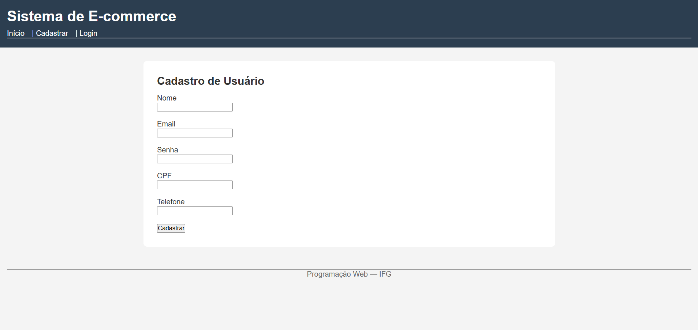
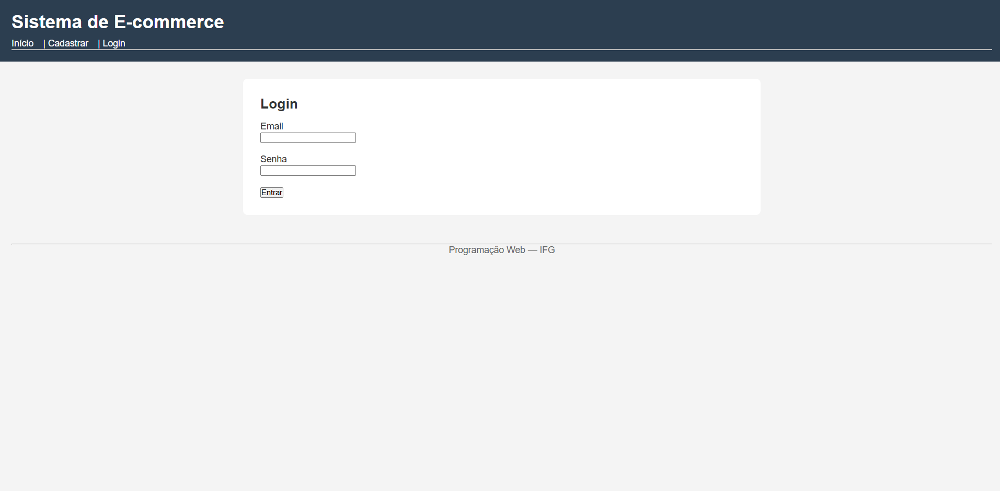
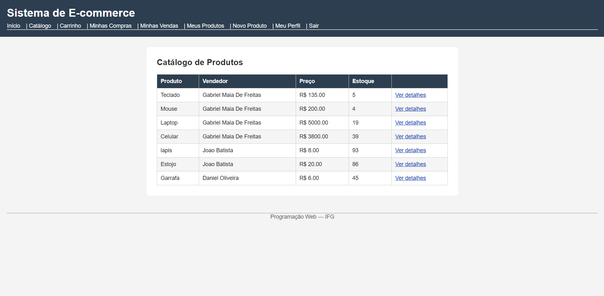
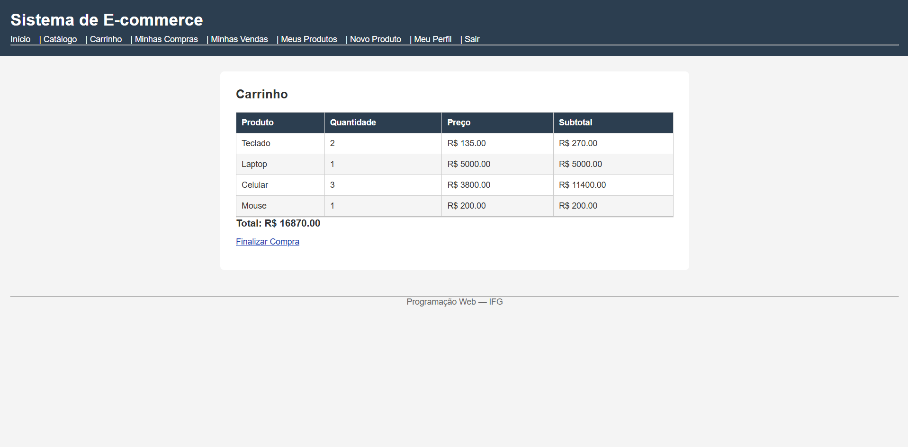
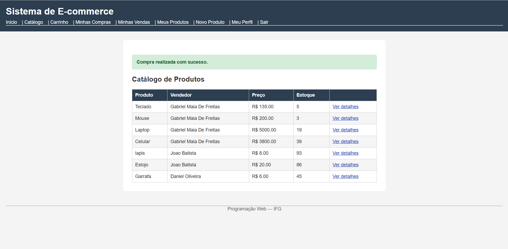
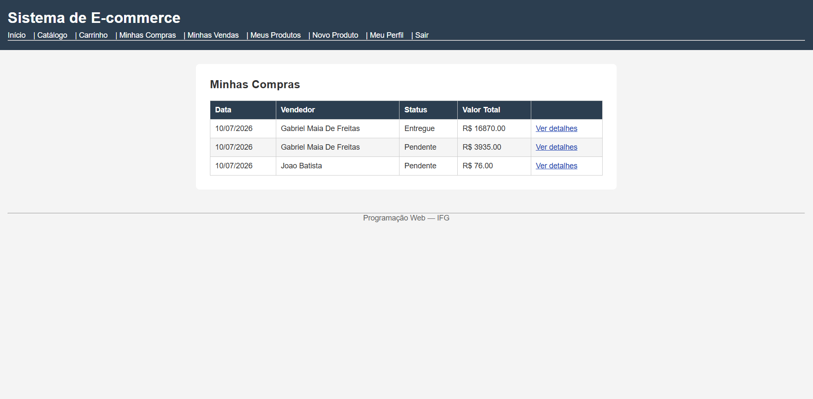
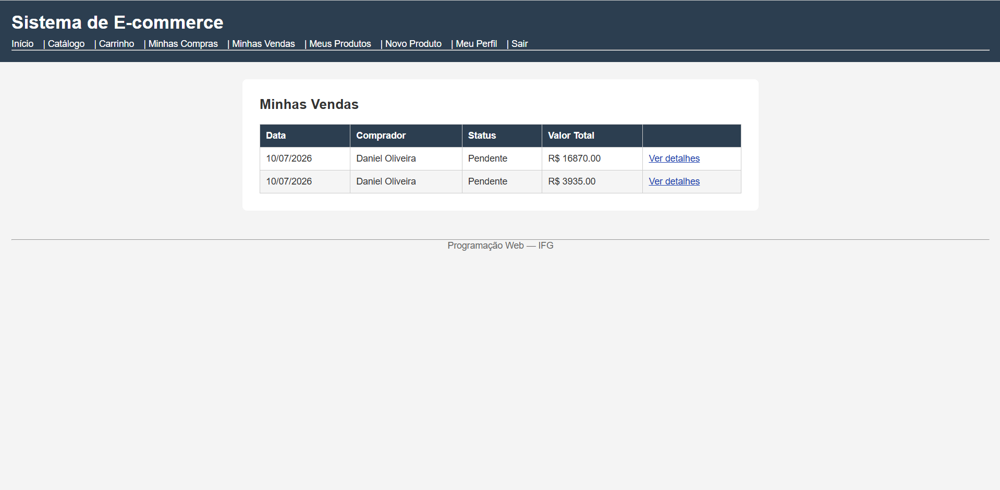

# Sistema de E-commerce com Sinatra e ActiveRecord

Projeto desenvolvido para a disciplina de **Programação Web** do **Instituto Federal de Goiás (IFG) – Campus Anápolis**.

A aplicação foi desenvolvida utilizando **Ruby**, **Sinatra**, **ActiveRecord** e **SQLite**, implementando um sistema simplificado de e-commerce no qual um mesmo usuário pode atuar como vendedor e comprador.

---

# Integrantes

- Gabriel Maia de Freitas

---

# Tecnologias Utilizadas

- Ruby
- Sinatra
- ActiveRecord
- SQLite3
- BCrypt
- ERB
- RSpec
- Rack::Test

---

# Dependências

Antes de executar o projeto, instale todas as dependências:

```bash
bundle install
```

---

# Preparação do Banco de Dados

Execute as migrations para criar o banco de dados:

```bash
bundle exec rake db:migrate
```

---

# Executando a Aplicação

Inicie o servidor com o comando:

```bash
bundle exec ruby app.rb
```

Após iniciar o servidor, acesse:

```
http://localhost:9292
```

---

# Executando os Testes

Para executar toda a suíte de testes:

```bash
bundle exec rspec
```

Todos os testes (Modelos, Rotas e Interface) podem ser executados utilizando apenas este comando.

---

# Funcionalidades Implementadas

## Usuário

- Cadastro
- Login
- Logout
- Edição do próprio perfil

## Vendedor

- Cadastro de produtos
- Edição de produtos
- Exclusão de produtos
- Listagem dos próprios produtos
- Consulta das vendas recebidas
- Atualização do status das vendas

## Comprador

- Catálogo de produtos
- Visualização dos detalhes do produto
- Adição de produtos ao carrinho
- Finalização de compras
- Histórico de compras
- Cancelamento de compras pendentes

---

# Segurança

As senhas dos usuários são armazenadas utilizando **BCrypt**, evitando o armazenamento em texto puro no banco de dados.

---

# Estrutura do Projeto

```
app/
db/
helpers/
models/
public/
spec/
views/

app.rb
config.ru
Gemfile
README.md
```

---

# Capturas de Tela

## Cadastro de Usuário



---

## Login



---

## Catálogo de Produtos



## Carrinho de Compras



---

## Finalizar Compra



---

## Minhas Compras



---

## Vendas Recebidas



---

# Observações

- O projeto utiliza ActiveRecord para persistência dos dados.
- O banco de dados utilizado é SQLite.
- As validações foram implementadas conforme especificado no trabalho.
- A finalização da compra utiliza transações para garantir a integridade dos dados.
- A suíte de testes cobre as camadas de Modelo, Rotas e Interface.
